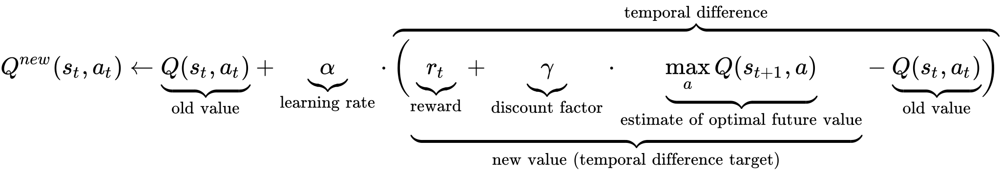

# Q-Learning

### Phase one
This is the first phase of the project that focuses on training the car to reach the peak by initializing and updating the Q-Table.
Here we use the [Bellman equation](https://en.wikipedia.org/wiki/Bellman_equation) as a simple [value iteration update](https://en.wikipedia.org/wiki/Markov_decision_process#Value_iteration).



#### Result (Phase one)
##### Not Using Epsilon Decay


As it's obvious, the car at episode 1, has no idea what to do. But after only 500 episodes 
it understands that by making progress to the right, he'll gain a point!
But there is an interesting point there:
***Although the car receives its reward by reaching the peak, as it's shown in the gif, it tried to minimize the spent time. To do that, at first it decreases amount of the path in goes forward and uses its gained velocity to reach the top!***

##### Using Epsilon Decay


Although the car reaches the peak in a quite acceptable time, by using epsilon decay we make model to ***explore*** more in order to find a better approach!
And as it's shown in above gif, the car minimizes it's spent time to reach the peak.


LR: 0.1 - DISCOUNT: 0.95 - EPISODES: 10000 - Use epsilon Decay: True - EPSILON: 0.5

### How to use:
First clone the repository:
```shell script
$ git clone https://github.com/FarzamTP/Deep-Q-Learning-Car-Mountain.git
$ cd Deep-Q-Learning-Car-Mountain
```
To setup the `virtual environment` and `activating` it:
```shell script
$ python3 -m venv venv
$ source venv/bin/activate
```

And to install the requirements:
```shell script
(venv)$ pip3 install -r requirements.txt
```

and run the `main.py` script:
```shell script
(venv)$ python3 main.py
```